# System Architecture — AI-Powered Restaurant Recommendation System

> **Tech stack:** Java 21 · Spring Boot 3.x · Spring AI (Groq via OpenAI-compatible API)  
> **Source of truth for problem & scope:** [Problem Statement](./problemStatment.md)  
> **Implementation guide:** [Implementation Plan](./implementation-plan.md) — phase-wise tasks and acceptance criteria.

This document describes the **detailed architecture** for a Zomato-inspired restaurant recommendation service. The backend is a **Spring Boot monolith** that filters structured restaurant data and uses an LLM (via **Spring AI**) to rank candidates and generate explanations.

---

## Table of Contents

1. [Architectural Goals](#1-architectural-goals)
2. [Technology Stack](#2-technology-stack)
3. [Architecture at a Glance](#3-architecture-at-a-glance)
4. [C4 Model Views](#4-c4-model-views)
5. [Spring Boot Layered Architecture](#5-spring-boot-layered-architecture)
6. [Core Pipeline](#6-core-pipeline)
7. [Component Architecture](#7-component-architecture)
8. [Package & Project Structure](#8-package--project-structure)
9. [Data Architecture](#9-data-architecture)
10. [Integration Architecture](#10-integration-architecture)
11. [Request Lifecycle & Sequences](#11-request-lifecycle--sequences)
12. [Configuration & Spring Profiles](#12-configuration--spring-profiles)
13. [Error Handling & Resilience](#13-error-handling--resilience)
14. [Security Architecture](#14-security-architecture)
15. [Deployment Architecture](#15-deployment-architecture)
16. [Quality Attributes](#16-quality-attributes)
17. [Architectural Decisions](#17-architectural-decisions)
18. [Evolution Path](#18-evolution-path)

---

## 1. Architectural Goals

Derived from the [problem statement](./problemStatment.md):

| Goal | Architectural implication |
|------|---------------------------|
| **Grounded recommendations** | Two-stage pipeline: deterministic filter → LLM over fixed candidate set only |
| **Personalization** | Session-scoped preferences + free-text soft constraints handled by LLM |
| **Transparency** | Explanations are first-class DTO fields; UI separates facts from AI text |
| **Repeatable demo flow** | Stateless v1; same inputs → same filter results |
| **Enterprise-ready foundation** | Spring Boot conventions, validation, actuator, testable services |
| **Safe failure** | Fallback ranking when LLM fails; validator rejects hallucinated names |

### Non-Goals (v1)

- User accounts, JWT/OAuth, or recommendation history
- Live Zomato API, booking, or real-time availability
- Map/geolocation services
- Multi-language support
- Microservices split (monolith for v1)

---

## 2. Technology Stack

| Layer | Technology | Purpose |
|-------|------------|---------|
| **Language** | Java 21 (LTS) | Records, pattern matching, virtual threads (optional) |
| **Framework** | Spring Boot 3.3+ | Auto-config, DI, REST, lifecycle |
| **Web** | Spring Web MVC | REST API (`@RestController`) |
| **Validation** | Jakarta Bean Validation | `@Valid` on request DTOs |
| **AI / LLM** | Spring AI | Chat client, structured output, provider abstraction |
| **LLM providers** | Groq (OpenAI-compatible API via `spring-ai-openai`) | Rank + explain |
| **JSON** | Jackson | DTO serialization, LLM response parsing |
| **HTTP client** | `RestClient` or `WebClient` | Hugging Face dataset download |
| **CSV / data** | Apache Commons CSV or Univocity | Parse exported dataset file |
| **Frontend (v1)** | Thymeleaf + HTMX *or* React SPA | Preference form + result cards |
| **Health / ops** | Spring Boot Actuator | `/actuator/health`, readiness |
| **Config** | `@ConfigurationProperties` + `application.yml` | Type-safe settings |
| **Build** | Maven | Dependencies, packaging |
| **Testing** | JUnit 5, Mockito, `@WebMvcTest`, `@SpringBootTest` | Unit + integration |
| **Optional** | Spring Cache (`@Cacheable`) | Cache metadata / identical LLM queries |
| **Optional** | Spring Retry | LLM transient failure retries |
| **Container** | Docker + distroless/eclipse-temurin JRE | Production deploy |

### Key Spring Boot dependencies (conceptual)

```xml
<!-- Core -->
spring-boot-starter-web
spring-boot-starter-validation
spring-boot-starter-actuator

<!-- AI (Groq uses OpenAI-compatible API) -->
spring-ai-openai-spring-boot-starter

<!-- Optional -->
spring-retry
spring-boot-starter-cache
spring-boot-starter-thymeleaf   <!-- if server-rendered UI -->
```

---

## 3. Architecture at a Glance

The system implements **Retrieve → Filter → Rank → Explain** (hybrid RAG without vector search):

```
                    ┌──────────────────────────────────────────────────────────┐
                    │     AI Restaurant Recommendation System (Spring Boot)     │
                    └──────────────────────────────────────────────────────────┘
                                              │
         ┌────────────────────────────────────┼────────────────────────────────────┐
         │                                    │                                    │
         ▼                                    ▼                                    ▼
┌─────────────────┐              ┌─────────────────────────┐            ┌──────────────────┐
│  Presentation   │              │   Spring Boot Backend    │            │  External Systems │
│ Thymeleaf/React │◄── REST ────►│   @RestController        │◄──────────►│  HF Dataset (CSV) │
└─────────────────┘              │   @Service layer         │            │  LLM Provider     │
                                 │   Spring AI ChatClient   │            └──────────────────┘
                                 └─────────────────────────┘
                                              │
                         ┌────────────────────┴────────────────────┐
                         │                                         │
                         ▼                                         ▼
               ┌─────────────────┐                       ┌─────────────────┐
               │ RestaurantFilter│                       │ PromptBuilder + │
               │ Service         │                       │ Spring AI       │
               │ (deterministic) │                       │ (generative)    │
               └────────┬────────┘                       └────────┬────────┘
                        │                                         │
                        └──────────────────┬──────────────────────┘
                                           ▼
                                ┌─────────────────────┐
                                │ InMemoryRestaurant  │
                                │ Repository (~51k)   │
                                └─────────────────────┘
```

**Central invariant:** Factual fields (name, rating, cost, cuisine, location) always come from the in-memory catalog. Spring AI produces **ranking, summary, tags, and explanations** only.

---

## 4. C4 Model Views

### 4.1 Level 1 — System Context

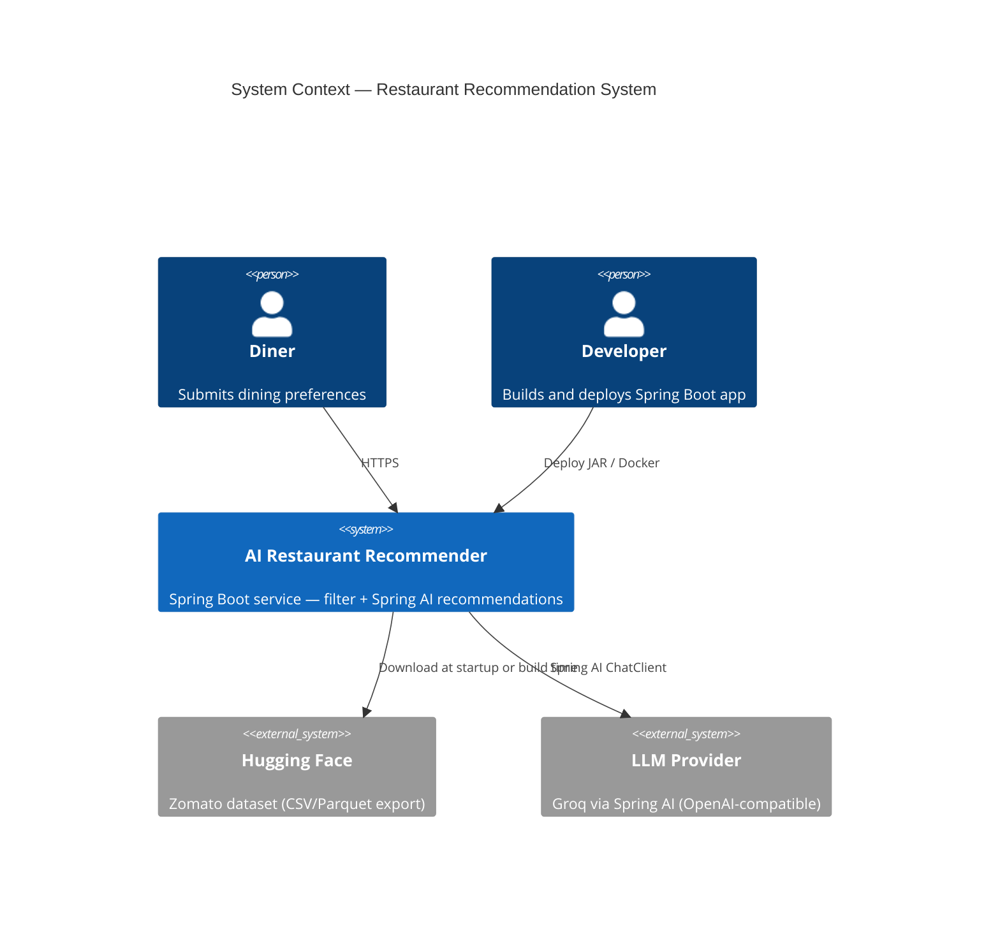

---

### 4.2 Level 2 — Container Diagram

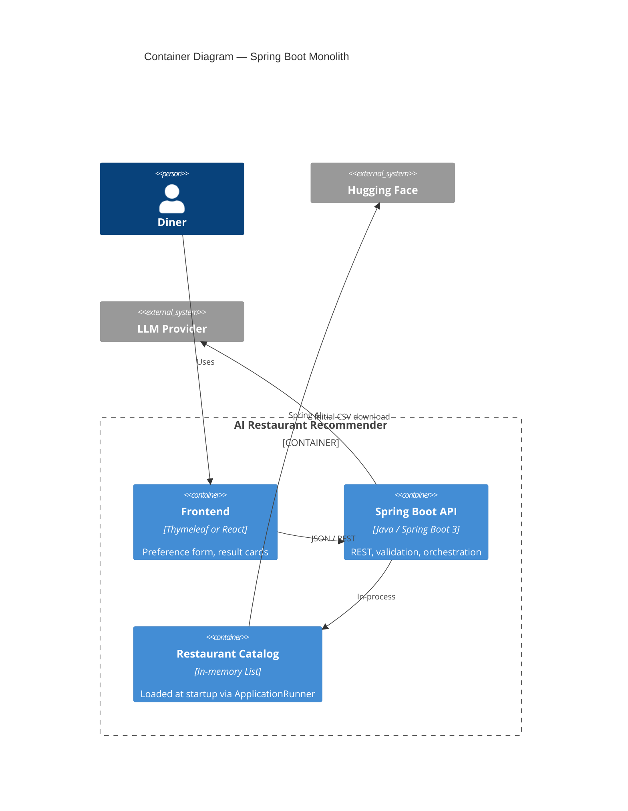

| Container | Technology | Responsibility |
|-----------|------------|----------------|
| **Frontend** | Thymeleaf + HTMX (v1 fast path) or React | Collect prefs; render cards |
| **Spring Boot API** | Java 21, Spring Boot 3 | REST boundary, services, Spring AI |
| **Restaurant Catalog** | `InMemoryRestaurantRepository` | Thread-safe read-only list after startup |

---

### 4.3 Level 3 — Component Diagram (Spring Boot internals)

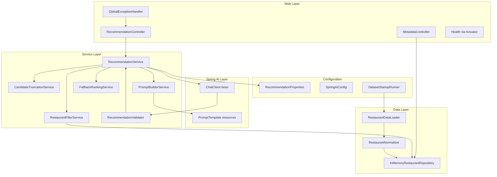

---

## 5. Spring Boot Layered Architecture

Classic Spring layering with strict dependency direction:

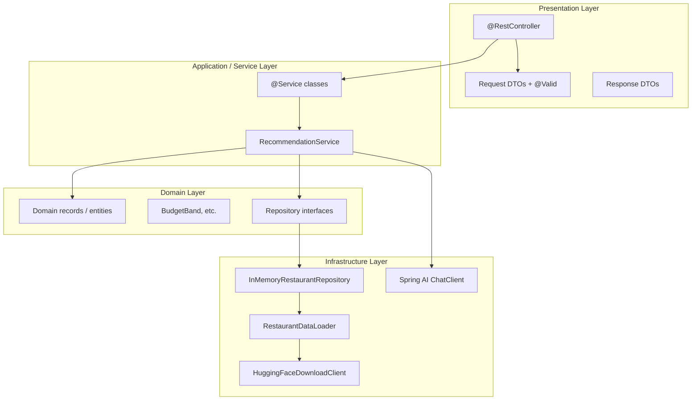

### Layer rules

| Layer | Spring stereotypes | Must NOT contain |
|-------|-------------------|------------------|
| **Presentation** | `@RestController`, DTOs | Filter logic, LLM prompts, CSV parsing |
| **Service** | `@Service` | HTTP status mapping, raw JSON from LLM |
| **Domain** | Records, enums, interfaces | Spring annotations (keep domain pure) |
| **Infrastructure** | `@Repository`, `@Component`, config | Business rules for budget bands |

**Dependency rule:** Controllers → Services → Domain ← Infrastructure implements domain ports.

---

## 6. Core Pipeline

Five stages aligned with the [problem statement workflow](./problemStatment.md#system-workflow):

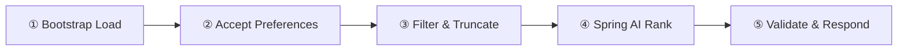

| Stage | Trigger | Spring component | Output |
|-------|---------|------------------|--------|
| **① Bootstrap Load** | `ApplicationRunner` on startup | `DatasetStartupRunner` → `RestaurantDataLoader` | Populated `InMemoryRestaurantRepository` |
| **② Accept Preferences** | HTTP POST | `RecommendationController` + `@Valid RecommendRequest` | `UserPreferences` domain object |
| **③ Filter & Truncate** | Service call | `RestaurantFilterService`, `CandidateTruncationService` | `List<Restaurant>` (≤ 25) |
| **④ Spring AI Rank** | Service call | `PromptBuilderService` + `ChatClient` | `LlmRecommendationResponse` |
| **⑤ Validate & Respond** | Service call | `RecommendationValidator` | `RecommendationResponse` DTO |

### Hard vs soft constraints

| Type | Handler | Examples |
|------|---------|----------|
| **Hard** | `RestaurantFilterService` (Java streams) | City, min rating, budget band, cuisine |
| **Soft** | Spring AI `ChatClient` | "Family-friendly", "cozy", "quick lunch" |

---

## 7. Component Architecture

### 7.1 Component catalog

| Component | Stereotype | Package | Responsibility |
|-----------|-----------|---------|----------------|
| `RecommendationController` | `@RestController` | `controller` | `POST /api/v1/recommend`, `GET /metadata` |
| `MetadataController` | `@RestController` | `controller` | Cities, cuisines for UI dropdowns |
| `GlobalExceptionHandler` | `@RestControllerAdvice` | `exception` | Map exceptions → problem JSON |
| `RecommendationService` | `@Service` | `service` | Orchestrate full pipeline |
| `RestaurantFilterService` | `@Service` | `service` | AND-composed hard filters |
| `CandidateTruncationService` | `@Service` | `service` | Cap candidates for LLM context |
| `PromptBuilderService` | `@Service` | `service` | Build system + user prompts |
| `RecommendationValidator` | `@Service` | `service` | Anti-hallucination checks |
| `FallbackRankingService` | `@Service` | `service` | Rating-based backup |
| `RestaurantDataLoader` | `@Component` | `data` | Load CSV/JSON from file or HF URL |
| `RestaurantNormalizer` | `@Component` | `data` | Parse cost, cuisines, ratings |
| `InMemoryRestaurantRepository` | `@Repository` | `repository` | Read-only catalog access |
| `HuggingFaceDownloadClient` | `@Component` | `client` | Download dataset file via HTTP |
| `SpringAiConfig` | `@Configuration` | `config` | `ChatClient` bean, model options |
| `RecommendationProperties` | `@ConfigurationProperties` | `config` | Budget thresholds, max candidates |
| `DatasetStartupRunner` | `ApplicationRunner` | `config` | Load catalog before accepting traffic |

---

### 7.2 Startup — Dataset bootstrap

Java has no Hugging Face `datasets` library. Use one of these **supported strategies**:

| Strategy | When to use | Flow |
|----------|-------------|------|
| **A — Bundled CSV** | Development / demos | Ship `src/main/resources/data/restaurants.csv` (subset or full export) |
| **B — Download on startup** | Production | `HuggingFaceDownloadClient` fetches file URL → cache to `./data/cache/` |
| **C — Build-time fetch** | CI/CD | Maven exec plugin downloads during build → packaged in JAR |

**Recommended v1:** Strategy **B** with local cache fallback to **A**.

```mermaid
sequenceDiagram
    participant Boot as Spring Boot
    participant Runner as DatasetStartupRunner
    participant HF as HuggingFaceDownloadClient
    participant Loader as RestaurantDataLoader
    participant Repo as InMemoryRestaurantRepository

    Boot->>Runner: ApplicationRunner.run()
    alt Cache file exists
        Runner->>Loader: loadFromPath(cache)
    else Cold start
        Runner->>HF: download(datasetUrl)
        HF-->>Runner: CSV bytes
        Runner->>Loader: parse + normalize
        Runner->>Runner: write cache file
    end
    Loader->>Repo: initialize(restaurants)
    Note over Repo: Read-only; thread-safe for concurrent reads
```

`DatasetStartupRunner` sets a `catalogReady` flag consumed by Actuator custom health indicator — API returns **503** until load completes.

---

### 7.3 RestaurantFilterService

Filter composition using Java `Stream` pipeline — all active filters combine with **AND**:

```java
// Conceptual — not production code
public List<Restaurant> filter(UserPreferences prefs, List<Restaurant> catalog) {
    return catalog.stream()
        .filter(r -> matchesLocation(r, prefs.location()))
        .filter(r -> matchesCuisine(r, prefs.cuisine()))
        .filter(r -> r.rating() >= prefs.minRating())
        .filter(r -> matchesBudget(r, prefs.budget(), properties))
        .toList();
}
```

| Filter | Logic |
|--------|-------|
| **Location** | `String.contains` ignore case on city/locality |
| **Cuisine** | Any cuisine token contains user input |
| **Min rating** | `rating >= minRating` |
| **Budget** | `BudgetBand` → INR range from `RecommendationProperties` |

If result is **empty**, `RecommendationService` returns immediately — **no Spring AI call**.

---

### 7.4 PromptBuilderService + Spring AI

**Prompt templates** stored in `src/main/resources/prompts/`:

```
prompts/
├── system.st          # Role, grounding rules, JSON schema
└── user.st            # Preferences + {candidates} placeholder
```

`PromptBuilderService` uses Spring AI `PromptTemplate` or String templates:

```java
@Service
public class PromptBuilderService {

    public Prompt buildPrompt(UserPreferences prefs, List<Restaurant> candidates) {
        String system = loadTemplate("prompts/system.st");
        String user = PromptTemplate.builder()
            .template(loadTemplate("prompts/user.st"))
            .variables(Map.of(
                "location", prefs.location(),
                "budget", prefs.budget().name(),
                "cuisine", prefs.cuisine(),
                "minRating", prefs.minRating(),
                "additionalPreferences", Optional.ofNullable(prefs.additionalPreferences()).orElse("None"),
                "topK", prefs.topK(),
                "candidatesJson", toCompactJson(candidates)
            ))
            .build()
            .render();
        return new Prompt(List.of(new SystemMessage(system), new UserMessage(user)));
    }
}
```

---

### 7.5 Spring AI ChatClient integration

```java
@Configuration
public class SpringAiConfig {

    @Bean
    ChatClient recommendationChatClient(ChatClient.Builder builder,
                                        RecommendationProperties props) {
        return builder
            .defaultOptions(ChatOptions.builder()
                .model(props.getLlm().getModel())
                .temperature(props.getLlm().getTemperature())
                .maxTokens(props.getLlm().getMaxTokens())
                .build())
            .build();
    }
}
```

**Structured output** — call with response type mapping:

```java
LlmRecommendationResponse raw = chatClient.prompt(prompt)
    .call()
    .entity(LlmRecommendationResponse.class);
```

Alternatively use `.call().content()` + Jackson `ObjectMapper` if provider lacks native structured output.

`application.yml`:

```yaml
spring:
  ai:
    openai:
      api-key: ${LLM_API_KEY}
      base-url: ${LLM_BASE_URL:https://api.groq.com/openai/v1}
      chat:
        options:
          model: llama-3.3-70b-versatile
          temperature: 0.4
```

---

### 7.6 RecommendationValidator

Mandatory post-LLM gate:

```java
@Service
public class RecommendationValidator {

    public RecommendationResult validate(
            LlmRecommendationResponse llm,
            List<Restaurant> candidates,
            int topK) {

        Set<String> allowedNames = candidates.stream()
            .map(Restaurant::name)
            .collect(Collectors.toSet());

        List<Recommendation> valid = llm.recommendations().stream()
            .filter(r -> allowedNames.contains(r.restaurantName()))
            .map(r -> mergeWithDataset(r, candidates))
            .limit(topK)
            .toList();

        return new RecommendationResult(valid, llm.summary(), candidates.size());
    }
}
```

Factual fields on the response DTO are **always copied from `Restaurant` domain records**, never from LLM output.

---

### 7.7 FallbackRankingService

Invoked when:

- `ChatClient` throws (timeout, 429, network)
- LLM returns invalid JSON
- Validator drops all entries

Returns top-K by `rating DESC` with template explanations from `MessageSource` or constants.

---

## 8. Package & Project Structure

```
restaurant-recommender/
├── pom.xml
├── Dockerfile
├── src/main/java/com/restaurant/recommender/
│   ├── RestaurantRecommenderApplication.java
│   ├── config/
│   │   ├── SpringAiConfig.java
│   │   ├── RecommendationProperties.java
│   │   ├── DatasetStartupRunner.java
│   │   └── WebConfig.java                    # CORS if React SPA
│   ├── controller/
│   │   ├── RecommendationController.java
│   │   └── MetadataController.java
│   ├── dto/
│   │   ├── request/RecommendRequest.java
│   │   └── response/
│   │       ├── RecommendationResponse.java
│   │       ├── RecommendationItemDto.java
│   │       └── MetadataResponse.java
│   ├── domain/
│   │   ├── Restaurant.java                   # Java record
│   │   ├── UserPreferences.java
│   │   ├── BudgetBand.java                   # enum
│   │   ├── Recommendation.java
│   │   └── LlmRecommendationResponse.java
│   ├── service/
│   │   ├── RecommendationService.java
│   │   ├── RestaurantFilterService.java
│   │   ├── CandidateTruncationService.java
│   │   ├── PromptBuilderService.java
│   │   ├── RecommendationValidator.java
│   │   └── FallbackRankingService.java
│   ├── repository/
│   │   ├── RestaurantRepository.java         # interface (port)
│   │   └── InMemoryRestaurantRepository.java
│   ├── data/
│   │   ├── RestaurantDataLoader.java
│   │   └── RestaurantNormalizer.java
│   ├── client/
│   │   └── HuggingFaceDownloadClient.java
│   └── exception/
│       ├── GlobalExceptionHandler.java
│       ├── CatalogNotReadyException.java
│       └── LlmServiceException.java
├── src/main/resources/
│   ├── application.yml
│   ├── application-dev.yml
│   ├── application-prod.yml
│   ├── prompts/
│   │   ├── system.st
│   │   └── user.st
│   └── data/
│       └── restaurants-sample.csv              # optional dev subset
└── src/test/java/com/restaurant/recommender/
    ├── service/RestaurantFilterServiceTest.java
    ├── service/RecommendationValidatorTest.java
    ├── controller/RecommendationControllerTest.java   # @WebMvcTest
    └── integration/RecommendationIntegrationTest.java # @SpringBootTest + mock ChatClient
```

---

## 9. Data Architecture

### 9.1 Dataset

| Attribute | Value |
|-----------|-------|
| **Source** | [ManikaSaini/zomato-restaurant-recommendation](https://huggingface.co/datasets/ManikaSaini/zomato-restaurant-recommendation) |
| **Volume** | ~51,717 records, ~574 MB |
| **Java access** | CSV export via HF HTTP or pre-processed cache file |
| **Role** | System of record for restaurant facts |

### 9.2 Domain model (Java records)

```java
public record Restaurant(
    String id,
    String name,
    String city,
    String location,
    List<String> cuisines,
    double rating,
    Integer costForTwo
) {}

public record UserPreferences(
    String location,
    BudgetBand budget,
    String cuisine,
    double minRating,
    String additionalPreferences,
    int topK
) {}

public record Recommendation(
    int rank,
    Restaurant restaurant,
    String explanation,
    List<String> tags
) {}
```

### 9.3 Request / Response DTOs

```java
public record RecommendRequest(
    @NotBlank String location,
    @NotNull BudgetBand budget,
    @NotBlank String cuisine,
    @DecimalMin("0.0") @DecimalMax("5.0") Double minRating,
    @Size(max = 500) String additionalPreferences,
    @Min(1) @Max(10) Integer topK
) {}

public record RecommendationResponse(
    String summary,
    int candidatesConsidered,
    List<RecommendationItemDto> recommendations,
    String message
) {}
```

### 9.4 In-memory catalog

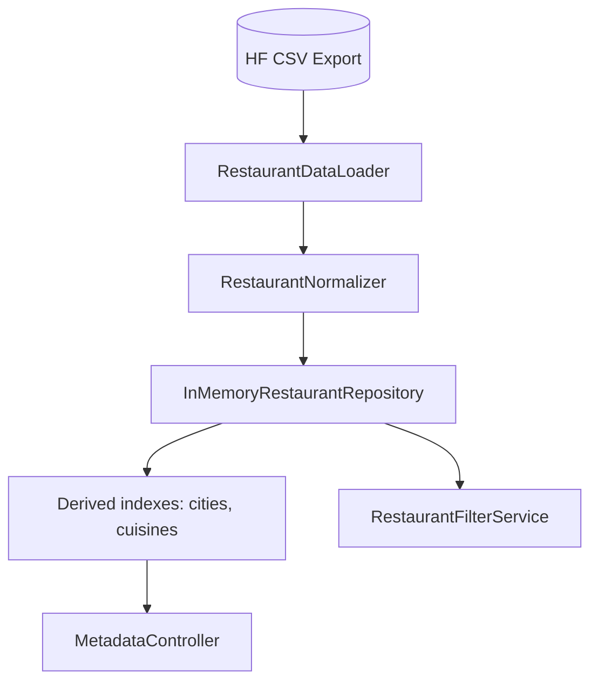

- **Storage:** `List<Restaurant>` wrapped in immutable snapshot after load
- **Concurrency:** Read-only after startup — safe for concurrent requests without locking
- **Indexes:** `Set<String>` cities and cuisines built at load for `/metadata` endpoint
- **No JPA / database for v1**

---

## 10. Integration Architecture

### 10.1 Hugging Face dataset integration

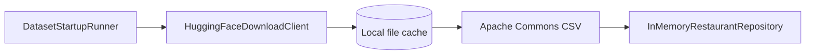

| Setting | `application.yml` key |
|---------|----------------------|
| Dataset URL | `app.dataset.url` |
| Cache path | `app.dataset.cache-path` |
| Force re-download | `app.dataset.force-download` |

Use Spring `RestClient` (Boot 3.2+) for download with connect/read timeouts.

### 10.2 Spring AI / LLM integration

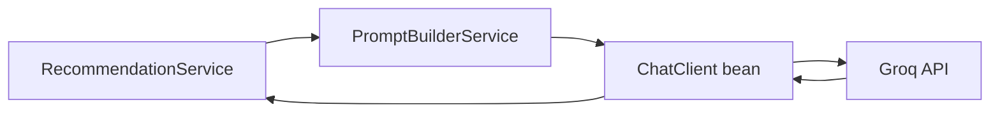

| Concern | Spring mechanism |
|---------|------------------|
| API key & base URL | `spring.ai.openai.api-key=${LLM_API_KEY}` + `spring.ai.openai.base-url=${LLM_BASE_URL:https://api.groq.com/openai}` (Spring AI appends `/v1`) |
| Model swap | Change `application.yml` or profile |
| Retry | `@Retryable` on service method (Spring Retry) |
| Timeout | `RestClient` / WebClient timeout in AI auto-config |
| Testing | `@MockBean ChatClient` in slice tests |

### 10.3 REST API boundary

| Endpoint | Method | Controller |
|----------|--------|------------|
| `/api/v1/recommend` | POST | `RecommendationController` |
| `/api/v1/metadata` | GET | `MetadataController` |
| `/actuator/health` | GET | Actuator (custom catalog indicator) |

---

## 11. Request Lifecycle & Sequences

### 11.1 Application startup

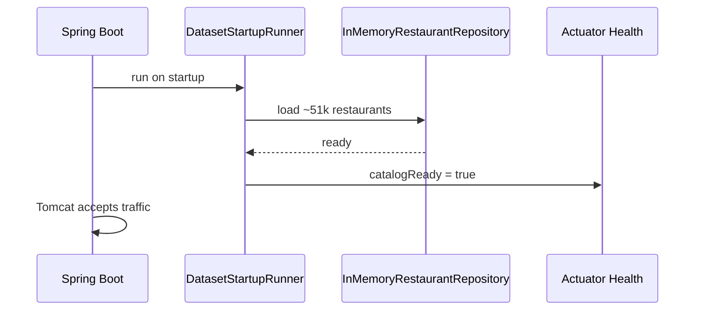

### 11.2 Recommendation request (happy path)

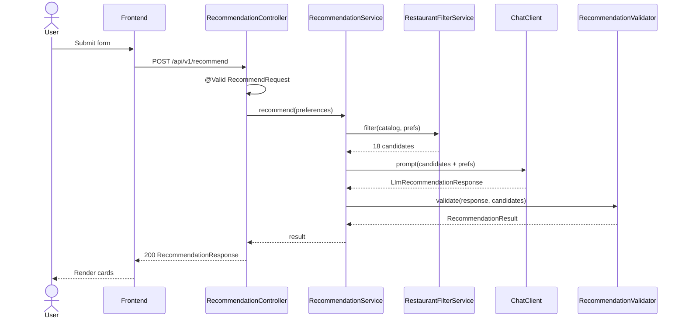

### 11.3 Empty filter — short-circuit

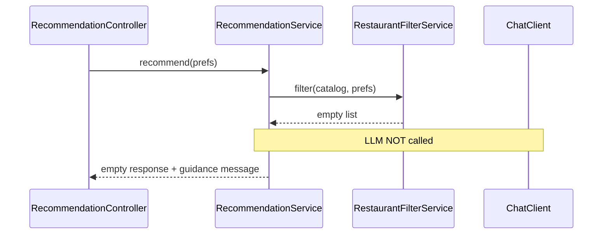

### 11.4 LLM failure — fallback

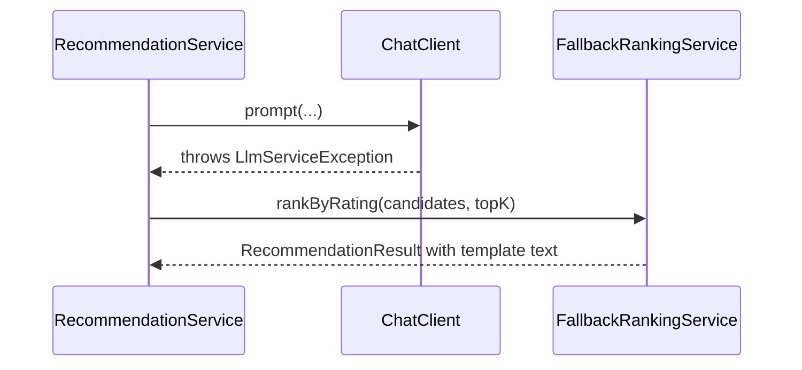

---

## 12. Configuration & Spring Profiles

### 12.1 `application.yml` structure

```yaml
server:
  port: 8080

spring:
  application:
    name: restaurant-recommender
  ai:
    openai:
      api-key: ${LLM_API_KEY}
      base-url: ${LLM_BASE_URL:https://api.groq.com/openai}  # Spring AI appends /v1
      chat:
        options:
          model: llama-3.3-70b-versatile
          temperature: 0.4
          max-tokens: 2000

app:
  dataset:
    url: ${DATASET_URL:https://huggingface.co/datasets/.../resolve/main/data.csv}
    cache-path: ${DATASET_CACHE_PATH:./data/restaurants.csv}
    force-download: false
  recommendation:
    max-candidates-for-llm: 25
    default-top-k: 5
    budget:
      low-max: 500
      medium-max: 1500
  llm:
    retry:
      max-attempts: 2
      backoff-ms: 1000

management:
  endpoints:
    web:
      exposure:
        include: health,info
  endpoint:
    health:
      show-details: when_authorized
```

### 12.2 Profiles

| Profile | Purpose |
|---------|---------|
| `dev` | Sample CSV subset, mock ChatClient optional, verbose logging |
| `prod` | Full dataset, real LLM, structured JSON logging |
| `test` | `@TestPropertySource`, tiny fixture CSV |

### 12.3 Configuration properties class

```java
@ConfigurationProperties(prefix = "app.recommendation")
public record RecommendationProperties(
    int maxCandidatesForLlm,
    int defaultTopK,
    BudgetThresholds budget,
    LlmRetryProperties llm
) {}
```

---

## 13. Error Handling & Resilience

### 13.1 Exception mapping (`@RestControllerAdvice`)

| Exception | HTTP | Response body |
|-----------|------|---------------|
| `MethodArgumentNotValidException` | 400 | Field errors map |
| `CatalogNotReadyException` | 503 | "Dataset still loading" |
| `LlmServiceException` | 200 | Fallback result (logged server-side) |
| `Exception` | 500 | Generic error message |

Use **RFC 7807** `ProblemDetail` (Spring 6+) for consistent error JSON.

### 13.2 Resilience patterns

| Pattern | Implementation |
|---------|----------------|
| **Fail fast at startup** | App won't mark healthy until catalog loads |
| **Short-circuit** | Empty filter → skip `ChatClient` |
| **Retry** | `@Retryable` on LLM call for 429/timeout |
| **Graceful degradation** | `FallbackRankingService` |
| **Virtual threads (optional)** | `spring.threads.virtual.enabled=true` for I/O-bound LLM waits |

---

## 14. Security Architecture

| Threat | Mitigation |
|--------|------------|
| API key exposure | `LLM_API_KEY` env var only; never in frontend or git |
| Prompt injection | System prompt instructs model to ignore override attempts |
| XSS in explanations | Escape Thymeleaf output; React default escaping |
| Unauthenticated abuse | Rate limiting (Bucket4j / API gateway) — future |
| CORS | `WebConfig` restricts origins in prod |

**v1:** No Spring Security auth — stateless public API per problem statement scope.

---

## 15. Deployment Architecture

### 15.1 Local development

```bash
./mvnw spring-boot:run -Dspring-boot.run.profiles=dev
```

Frontend: Thymeleaf served from same JAR, or React `npm run dev` with CORS to `localhost:8080`.

### 15.2 Docker deployment

```dockerfile
FROM eclipse-temurin:21-jre-alpine
WORKDIR /app
COPY target/restaurant-recommender-*.jar app.jar
ENV LLM_API_KEY="" DATASET_CACHE_PATH=/data/restaurants.csv
VOLUME /data
EXPOSE 8080
ENTRYPOINT ["java", "-jar", "app.jar", "--spring.profiles.active=prod"]
```

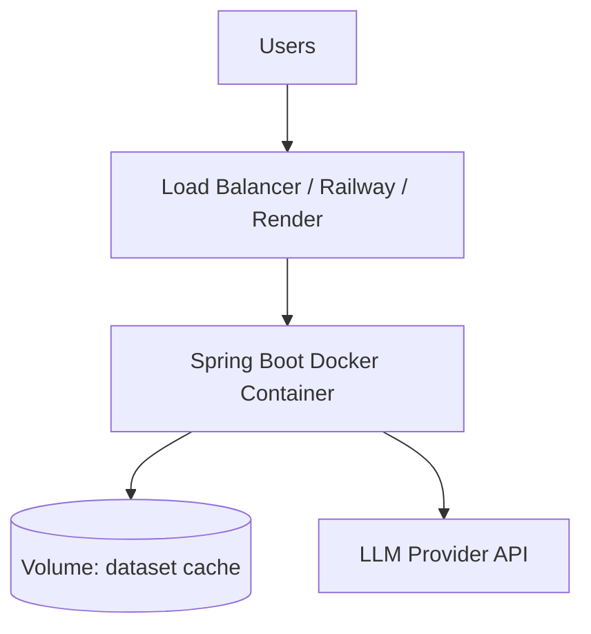

| Concern | v1 approach |
|---------|-------------|
| **Packaging** | Executable Spring Boot JAR |
| **Memory** | ≥ 1 GB heap (51k records + JVM overhead) |
| **Health check** | `GET /actuator/health` |
| **Secrets** | Platform env vars |
| **Scaling** | Horizontal replicas; each loads its own catalog snapshot |

---

## 16. Quality Attributes

| Attribute | Target | Spring Boot support |
|-----------|--------|---------------------|
| **Correctness** | No hallucinated restaurants | Validator service + filter-first |
| **Latency** | P95 < 10s | Virtual threads; async LLM optional |
| **Testability** | ≥ 80% service coverage | `@WebMvcTest`, `@MockBean ChatClient` |
| **Observability** | Trace filter → LLM | Micrometer metrics, structured logs |
| **Maintainability** | Clear packages | Standard Spring layering |
| **Portability** | JAR + Docker | Cloud-neutral deployment |

### Recommended metrics (Micrometer)

- `recommendation.requests.total`
- `recommendation.filter.candidates` (histogram)
- `recommendation.llm.latency`
- `recommendation.llm.fallback.total`
- `recommendation.validator.dropped.total`

---

## 17. Architectural Decisions

### ADR-001: Spring Boot monolith (not microservices)

| | |
|---|---|
| **Context** | v1 scope is single bounded context; team learning LLM integration |
| **Decision** | Single Spring Boot application |
| **Consequences** | (+) Simple deploy. (−) Scale LLM and filter together |

### ADR-002: Spring AI for LLM abstraction

| | |
|---|---|
| **Context** | Need provider swap and structured output with minimal boilerplate |
| **Decision** | Use Spring AI `ChatClient` with starter dependencies |
| **Consequences** | (+) Idiomatic Spring; auto-config. (−) Spring AI still evolving |

### ADR-003: In-memory repository (no JPA)

| | |
|---|---|
| **Context** | ~51k read-only rows; no user persistence |
| **Decision** | `InMemoryRestaurantRepository` loaded at startup |
| **Consequences** | (+) Fast filters; no DB ops. (−) Memory footprint; cold start |

### ADR-004: CSV via HTTP instead of Python HF library

| | |
|---|---|
| **Context** | No Java equivalent of Hugging Face `datasets` |
| **Decision** | Download CSV export; parse with Apache Commons CSV; cache locally |
| **Consequences** | (+) Pure Java stack. (−) Requires one-time export URL or bundled sample |

### ADR-005: Mandatory RecommendationValidator

| | |
|---|---|
| **Context** | LLMs invent restaurant names |
| **Decision** | Validate every LLM name against candidate set before response |
| **Consequences** | (+) Trustworthy UI. (−) Occasionally fewer than topK results |

### ADR-006: Skip LLM on empty filter results

| | |
|---|---|
| **Context** | Empty candidate prompts cause hallucination |
| **Decision** | `RecommendationService` returns early without calling `ChatClient` |
| **Consequences** | (+) Safer, cheaper. (−) None |

---

## 18. Evolution Path

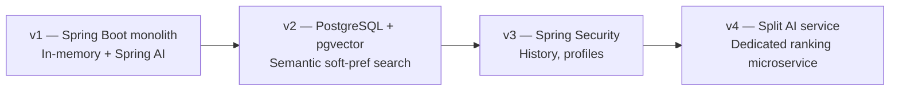

| Version | Change |
|---------|--------|
| **v1** | Current — monolith, in-memory, Spring AI |
| **v2** | Add Spring Data JPA + pgvector for embedding search on free text |
| **v3** | Spring Security, user profiles, saved searches |
| **v4** | Extract LLM ranking to separate service; async via Spring `@Async` or messaging |

---

## Related Documents

| Document | Use when |
|----------|----------|
| [Problem Statement](./problemStatment.md) | Goals, scope, success criteria |
| [Implementation Plan](./implementation-plan.md) | Phase-wise tasks, deliverables, and acceptance criteria |
| [Edge Cases](./edgecase.md) | System edge cases, failure modes, and mitigation strategies |
| [Evaluation Criteria](./eval/) | Phase-by-phase testing checklists, metrics, and quality gates |

---

*Stack: Java 21 · Spring Boot 3.x · Spring AI · Last updated: June 2025*
