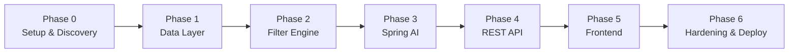
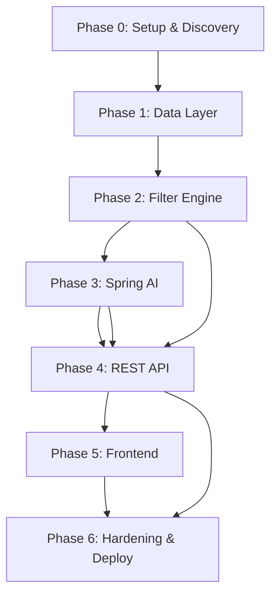

# Phase-Wise Implementation Plan

> **Stack:** Java 21 · Spring Boot 3.x · Spring AI (Groq via OpenAI-compatible API)  
> **Based on:** [Problem Statement](./problemStatment.md) · [Architecture](./architecture.md)

This document breaks the AI-Powered Restaurant Recommendation System into **six implementation phases**. Each phase has goals, tasks, deliverables, acceptance criteria, and verification steps aligned with the problem statement success criteria.

---

## Overview



| Phase | Name | Outcome | Est. effort |
|-------|------|---------|-------------|
| **0** | Project setup & dataset discovery | Runnable empty Spring Boot app + documented schema | 1–2 days |
| **1** | Data ingestion & catalog | ~51k restaurants loaded in memory at startup | 2–3 days |
| **2** | Filter & truncation | Deterministic candidate selection from preferences | 2–3 days |
| **3** | Spring AI integration | Grounded LLM ranking + explanations | 3–4 days |
| **4** | REST API & orchestration | Full backend pipeline via HTTP | 2–3 days |
| **5** | Frontend | User can submit prefs and view results | 2–4 days |
| **6** | Hardening, testing & deployment | Production-ready demo with Docker | 2–3 days |

**Total estimate:** ~14–22 days (single developer, part-time adjust accordingly)

---

## Success Criteria Mapping

Every phase contributes to the [problem statement success criteria](./problemStatment.md#success-criteria):

| Success criterion | Phases that prove it |
|-------------------|----------------------|
| Hard constraints respected | Phase 2 (filter), Phase 4 (E2E API test) |
| LLM grounded in dataset rows | Phase 3 (validator), Phase 6 (integration tests) |
| Each recommendation has explanation | Phase 3 (prompt), Phase 5 (UI cards) |
| End-to-end repeatable flow | Phase 4 + 5 + 6 (full demo) |

---

## Phase 0 — Project Setup & Dataset Discovery

### Goal

Bootstrap the Spring Boot project and understand the Hugging Face dataset before writing business logic.

### Prerequisites

- JDK 21 installed
- Maven 3.9+
- IDE (IntelliJ IDEA recommended)
- Hugging Face account (optional, for large downloads)
- LLM API key (needed from Phase 3 onward)

### Tasks

#### 0.1 Initialize Spring Boot project

- [ ] Generate project via [start.spring.io](https://start.spring.io):
  - **Group:** `com.restaurant`
  - **Artifact:** `recommender`
  - **Java:** 21
  - **Dependencies:** Spring Web, Validation, Actuator, Spring AI OpenAI (for Groq compatibility)
- [ ] Add Maven dependencies: Apache Commons CSV, Spring Retry (optional)
- [ ] Create package structure per [architecture §8](./architecture.md#8-package--project-structure)
- [ ] Add `.gitignore` (target/, `.env`, `data/*.csv` if large)
- [ ] Add `.env.example` with `LLM_API_KEY`, `LLM_BASE_URL`, `DATASET_URL`, `DATASET_CACHE_PATH`

#### 0.2 Base configuration

- [ ] Create `application.yml`, `application-dev.yml`, `application-prod.yml`
- [ ] Add `RecommendationProperties` and `DatasetProperties` with `@ConfigurationProperties`
- [ ] Enable Actuator health endpoint
- [ ] Verify app starts: `./mvnw spring-boot:run`

#### 0.3 Dataset exploration

- [ ] Download sample from [ManikaSaini/zomato-restaurant-recommendation](https://huggingface.co/datasets/ManikaSaini/zomato-restaurant-recommendation)
- [ ] Document actual column names, types, null rates → **`docs/dataset-schema.md`**
- [ ] Identify columns for: name, city, location, cuisines, rating, cost for two
- [ ] Analyze cost distribution → calibrate budget bands (low / medium / high)
- [ ] Export **dev subset** (~500 rows) → `src/main/resources/data/restaurants-sample.csv`
- [ ] List top cities and cuisines for metadata endpoint

#### 0.4 CI skeleton (optional)

- [ ] GitHub Actions / local script: `./mvnw verify` on push

### Deliverables

| Artifact | Location |
|----------|----------|
| Spring Boot skeleton | `pom.xml`, main application class |
| Config files | `src/main/resources/application*.yml` |
| Dataset schema doc | `docs/dataset-schema.md` |
| Dev sample CSV | `src/main/resources/data/restaurants-sample.csv` |
| Environment template | `.env.example` |

### Acceptance criteria

- [ ] `./mvnw clean verify` passes (empty or smoke test only)
- [ ] `GET /actuator/health` returns `UP`
- [ ] `docs/dataset-schema.md` lists all columns with mapping to domain model
- [ ] Budget thresholds documented with data-backed rationale

### Verification

```bash
./mvnw spring-boot:run -Dspring-boot.run.profiles=dev
curl http://localhost:8080/actuator/health
```

---

## Phase 1 — Data Ingestion & In-Memory Catalog

### Goal

Implement [problem statement workflow §1 — Data Ingestion](./problemStatment.md#1-data-ingestion): load, normalize, and store restaurants in an in-memory repository at startup.

### Depends on

Phase 0 complete (`dataset-schema.md`, sample CSV)

### Tasks

#### 1.1 Domain model

- [ ] Create Java records:
  - `Restaurant`
  - `BudgetBand` (enum)
  - `UserPreferences` (domain, not DTO)
- [ ] Create port interface: `RestaurantRepository`

#### 1.2 Normalizer

- [ ] Implement `RestaurantNormalizer`:
  - Trim strings; normalize city/location to lowercase for matching
  - Parse rating → `double` (skip or default invalid rows per config)
  - Parse cost-for-two → `Integer` (handle `"₹800"`, `"800 for two"`, nulls)
  - Split cuisines on `,` → `List<String>`
  - Generate stable `id` (hash of name + city or row index)

#### 1.3 Data loader

- [ ] Implement `RestaurantDataLoader` — parse CSV with Apache Commons CSV
- [ ] Map CSV columns using schema from `docs/dataset-schema.md`
- [ ] Implement `HuggingFaceDownloadClient` with `RestClient` (timeouts, retry)
- [ ] Support load from: cache file → download URL → classpath sample (dev profile)

#### 1.4 Repository

- [ ] Implement `InMemoryRestaurantRepository`:
  - `initialize(List<Restaurant>)` — called once at startup
  - `findAll()` — returns immutable snapshot
  - `getCities()` / `getCuisines()` — derived indexes for metadata
  - Throw `CatalogNotReadyException` if queried before init

#### 1.5 Startup runner

- [ ] Implement `DatasetStartupRunner` (`ApplicationRunner`):
  - Load dataset on startup (dev profile → sample CSV)
  - Log row count and load duration
  - Set `catalogReady` flag for health indicator
- [ ] Add custom Actuator `HealthIndicator` — `DOWN` until catalog loaded

### Deliverables

| Class | Package |
|-------|---------|
| `Restaurant`, `BudgetBand` | `domain` |
| `RestaurantRepository`, `InMemoryRestaurantRepository` | `repository` |
| `RestaurantNormalizer`, `RestaurantDataLoader` | `data` |
| `HuggingFaceDownloadClient` | `client` |
| `DatasetStartupRunner`, `CatalogHealthIndicator` | `config` |

### Acceptance criteria

- [ ] App loads dev sample CSV on startup; logs `"Loaded N restaurants"`
- [ ] `/actuator/health` is `DOWN` during load, then `UP`
- [ ] Repository returns correct count matching CSV row count (minus skipped invalid rows)
- [ ] `getCities()` returns non-empty sorted set
- [ ] Unit tests: `RestaurantNormalizerTest` covers cost parsing, cuisine split, bad ratings

### Verification

```bash
./mvnw test -Dtest=RestaurantNormalizerTest
./mvnw spring-boot:run -Dspring-boot.run.profiles=dev
# Check logs for "Loaded 500 restaurants" (or actual sample size)
```

---

## Phase 2 — Filter & Candidate Truncation

### Goal

Implement deterministic filtering ([problem statement §3](./problemStatment.md#3-integration-layer) hard constraints) without LLM.

### Depends on

Phase 1 complete (populated repository)

### Tasks

#### 2.1 Filter service

- [ ] Implement `RestaurantFilterService` with stream-based AND filters:
  - **Location** — case-insensitive substring on city or location
  - **Cuisine** — any cuisine token contains user input
  - **Min rating** — `rating >= minRating`
  - **Budget** — `costForTwo` within band from `RecommendationProperties`
- [ ] Handle null `costForTwo` (exclude or include per config — document choice)

#### 2.2 Truncation service

- [ ] Implement `CandidateTruncationService`:
  - If candidates ≤ `maxCandidatesForLlm` → return all
  - Else sort by `rating DESC`, then `costForTwo ASC` → take top N
  - Return wrapper with `originalCount` and `truncatedList`

#### 2.3 Configuration

- [ ] Wire budget thresholds in `RecommendationProperties`:
  ```yaml
  app.recommendation.budget.low-max: 500
  app.recommendation.budget.medium-max: 1500
  ```
- [ ] Map `BudgetBand.LOW | MEDIUM | HIGH` to INR ranges

#### 2.4 Dev CLI / test controller (temporary)

- [ ] Optional: `GET /api/v1/debug/filter?location=Bangalore&...` for manual testing
- [ ] Remove or disable in prod profile before Phase 6

### Deliverables

| Class | Purpose |
|-------|---------|
| `RestaurantFilterService` | Hard constraint filtering |
| `CandidateTruncationService` | Cap LLM input size |
| `RestaurantFilterServiceTest` | Unit tests for each filter |
| `CandidateTruncationServiceTest` | Truncation and sort order |

### Acceptance criteria

- [ ] Filter respects **all four** hard constraints simultaneously
- [ ] Bangalore + Italian + medium + min 4.0 returns only matching rows from sample data
- [ ] Empty filter result returns empty list (not exception)
- [ ] Truncation preserves highest-rated candidates when input > max
- [ ] ≥ 90% branch coverage on filter service

### Verification

```bash
./mvnw test -Dtest=RestaurantFilterServiceTest,CandidateTruncationServiceTest
# Manual: hit debug endpoint or write CommandLineRunner smoke test
```

---

## Phase 3 — Spring AI Integration

### Goal

Implement [problem statement §4 — Recommendation Engine](./problemStatment.md#4-recommendation-engine-llm): LLM ranks candidates and generates explanations, grounded in filtered data.

### Depends on

Phase 2 complete; `LLM_API_KEY` configured

### Tasks

#### 3.1 Spring AI configuration

- [ ] Add `spring-ai-openai-spring-boot-starter` to `pom.xml` (Groq offers an OpenAI-compatible API)
- [ ] Create `SpringAiConfig` — define `ChatClient` bean with model, temperature, max tokens
- [ ] Configure `spring.ai.openai.api-key=${LLM_API_KEY}` and `spring.ai.openai.base-url=${LLM_BASE_URL:https://api.groq.com/openai/v1}` in `application.yml`

#### 3.2 Prompt templates

- [ ] Create `src/main/resources/prompts/system.st`:
  - Role: restaurant recommendation assistant
  - Rules: only recommend from candidate list; output JSON; no invented restaurants
  - Include JSON schema for response
- [ ] Create `src/main/resources/prompts/user.st`:
  - Placeholders: location, budget, cuisine, minRating, additionalPreferences, topK, candidatesJson
- [ ] Implement `PromptBuilderService` using Spring AI `PromptTemplate`

#### 3.3 LLM response model

- [ ] Create `LlmRecommendationResponse` record matching expected JSON:
  ```json
  {
    "summary": "...",
    "recommendations": [
      { "restaurantName": "...", "rank": 1, "explanation": "...", "tags": [] }
    ]
  }
  ```
- [ ] Call `chatClient.prompt(...).call().entity(LlmRecommendationResponse.class)`

#### 3.4 Response validator

- [ ] Implement `RecommendationValidator`:
  - Assert every `restaurantName` exists in candidate set
  - Drop invalid entries; log warnings
  - Merge factual fields from `Restaurant` domain object (never trust LLM for rating/cost)
  - Re-number ranks if gaps after drops

#### 3.5 Fallback ranker

- [ ] Implement `FallbackRankingService`:
  - Sort candidates by rating DESC, take top K
  - Template explanation: `"Top-rated {cuisine} option in {location} within your budget and rating criteria."`
- [ ] Invoke when LLM throws or validator rejects all entries

#### 3.6 Retry

- [ ] Add `@Retryable` on LLM call for transient errors (timeout, 429)
- [ ] Configure max attempts and backoff in `application.yml`

#### 3.7 Prompt iteration

- [ ] Test with real preferences; refine system prompt until:
  - Explanations reference user preferences
  - No hallucinated restaurant names in 10+ trial runs
  - JSON parses reliably

### Deliverables

| Artifact | Location |
|----------|----------|
| `SpringAiConfig` | `config` |
| `PromptBuilderService` | `service` |
| `RecommendationValidator`, `FallbackRankingService` | `service` |
| Prompt templates | `resources/prompts/` |
| `LlmRecommendationResponse` | `domain` |
| Unit + integration tests | `src/test/` |

### Acceptance criteria

- [ ] LLM receives only truncated candidate list (never full 51k catalog)
- [ ] Validator rejects hallucinated names in mock test
- [ ] Fallback returns results when `ChatClient` mocked to throw
- [ ] Factual fields on output match dataset, not LLM text
- [ ] Empty candidate list → **LLM not called** (tested in Phase 4 orchestrator)

### Verification

```bash
export LLM_API_KEY=gsk_...
export LLM_BASE_URL=https://api.groq.com/openai/v1
./mvnw test -Dtest=RecommendationValidatorTest
./mvnw test -Dtest=PromptBuilderServiceTest
# Manual integration test with @SpringBootTest + real API (optional, @EnabledIfEnvironmentVariable)
```

---

## Phase 4 — REST API & Orchestration

### Goal

Wire the full pipeline into HTTP endpoints ([architecture §10.3](./architecture.md#103-rest-api-boundary)); implement [problem statement workflow](./problemStatment.md#system-workflow) end-to-end on the backend.

### Depends on

Phases 1–3 complete

### Tasks

#### 4.1 Request / response DTOs

- [ ] `RecommendRequest` with Jakarta validation annotations
- [ ] `RecommendationResponse`, `RecommendationItemDto`, `MetadataResponse`
- [ ] Mapper: `RecommendRequest` → `UserPreferences` domain object

#### 4.2 Recommendation orchestrator

- [ ] Implement `RecommendationService.recommend(UserPreferences)`:
  1. Load candidates from repository
  2. Filter → truncate
  3. If empty → return empty response with guidance message
  4. Build prompt → call ChatClient
  5. Validate → or fallback on failure
  6. Return `RecommendationResult`

#### 4.3 Controllers

- [ ] `RecommendationController`:
  - `POST /api/v1/recommend` → `@Valid @RequestBody RecommendRequest`
- [ ] `MetadataController`:
  - `GET /api/v1/metadata` → cities, cuisines, budget bands

#### 4.4 Exception handling

- [ ] `GlobalExceptionHandler` (`@RestControllerAdvice`):
  - `MethodArgumentNotValidException` → 400 + field errors
  - `CatalogNotReadyException` → 503
  - Generic → 500 with safe message
- [ ] Use Spring `ProblemDetail` (RFC 7807)

#### 4.5 CORS (if SPA planned)

- [ ] `WebConfig` — allow `http://localhost:5173` in dev profile

### API contract

#### `POST /api/v1/recommend`

**Request:**
```json
{
  "location": "Bangalore",
  "budget": "MEDIUM",
  "cuisine": "Italian",
  "minRating": 4.0,
  "additionalPreferences": "family-friendly",
  "topK": 5
}
```

**Response (200):**
```json
{
  "summary": "Strong Italian options in Bangalore for families...",
  "candidatesConsidered": 18,
  "recommendations": [
    {
      "rank": 1,
      "name": "Example Trattoria",
      "cuisines": ["Italian"],
      "rating": 4.3,
      "costForTwo": 1200,
      "location": "Indiranagar, Bangalore",
      "explanation": "Highly rated and mid-range; spacious seating...",
      "tags": ["best_overall"]
    }
  ],
  "message": null
}
```

#### `GET /api/v1/metadata`

```json
{
  "cities": ["Bangalore", "Delhi", "..."],
  "cuisines": ["Italian", "Chinese", "..."],
  "budgetBands": ["LOW", "MEDIUM", "HIGH"]
}
```

### Deliverables

| Class | Purpose |
|-------|---------|
| `RecommendationService` | Pipeline orchestrator |
| `RecommendationController`, `MetadataController` | REST layer |
| `GlobalExceptionHandler` | Error mapping |
| `@WebMvcTest` for controllers | Slice tests |
| `@SpringBootTest` integration test | Full pipeline with mock ChatClient |

### Acceptance criteria

- [ ] Valid request returns 200 with ≤ `topK` recommendations
- [ ] Invalid budget enum returns 400 with field error
- [ ] Request before catalog ready returns 503
- [ ] No-match filters return 200 with empty list + helpful `message`
- [ ] LLM failure returns 200 with fallback results (not 500)
- [ ] OpenAPI/Swagger optional but recommended (`springdoc-openapi`)

### Verification

```bash
./mvnw spring-boot:run -Dspring-boot.run.profiles=dev

curl -X POST http://localhost:8080/api/v1/recommend \
  -H "Content-Type: application/json" \
  -d '{"location":"Bangalore","budget":"MEDIUM","cuisine":"Italian","minRating":4.0,"topK":5}'

curl http://localhost:8080/api/v1/metadata
```

---

## Phase 5 — Frontend

### Goal

Implement [problem statement §5 — Output Display](./problemStatment.md#5-output-display): user-friendly UI for input and results.

### Depends on

Phase 4 complete (working REST API)

### Option A — Thymeleaf + HTMX (recommended for speed)

#### Tasks

- [ ] Add `spring-boot-starter-thymeleaf`
- [ ] Create `index.html` — preference form (location, budget, cuisine, rating, notes)
- [ ] Populate dropdowns from `GET /api/v1/metadata` on page load
- [ ] HTMX `POST /api/v1/recommend` → swap results partial into DOM
- [ ] `fragments/recommendation-cards.html` — card per restaurant:
  - Name, cuisine, rating, cost (from API)
  - AI explanation (visually distinct block)
  - Rank badge, optional tags
- [ ] Loading spinner during LLM wait (~3–10s)
- [ ] Empty state and error partials

### Option B — React SPA

#### Tasks

- [ ] Vite + React in `frontend/` directory
- [ ] Form component with validation mirroring `RecommendRequest`
- [ ] `RecommendationCard` component
- [ ] Fetch metadata on mount; POST on submit
- [ ] CORS configured in backend `WebConfig`
- [ ] Build → copy static assets or serve separately on `:5173`

### Deliverables

| Artifact | Description |
|----------|-------------|
| Preference form | All required fields from problem statement |
| Result cards | Name, cuisine, rating, cost, AI explanation |
| Empty / error states | User guidance when no matches |
| Loading UX | Visible feedback during LLM call |

### Acceptance criteria

- [ ] User can complete full flow without curl/Postman
- [ ] Factual fields and explanation clearly separated in UI
- [ ] Form validates required fields before submit
- [ ] No-match case shows message suggesting relaxed filters
- [ ] Works on Chrome/Firefox desktop (mobile nice-to-have)

### Verification

Manual walkthrough:

1. Open app → see form with city/cuisine dropdowns
2. Submit Bangalore / Medium / Italian / 4.0+ → see ≤ 5 cards with explanations
3. Submit impossible combo → see empty state message
4. Disconnect LLM key → still see fallback results (Phase 3+4 behavior)

---

## Phase 6 — Hardening, Testing & Deployment

### Goal

Production-quality demo: tests, observability, Docker, documentation — proving all [success criteria](./problemStatment.md#success-criteria).

### Depends on

Phases 0–5 complete

### Tasks

#### 6.1 Test suite

- [ ] Unit tests: normalizer, filter, truncator, validator, fallback (target ≥ 80% service coverage)
- [ ] `@WebMvcTest`: controllers with MockMvc
- [ ] `@SpringBootTest`: full pipeline with `@MockBean ChatClient`
- [ ] Test fixtures: `src/test/resources/restaurants-test.csv` (10–20 rows)
- [ ] Remove or `@Profile("dev")` debug endpoints

#### 6.2 Observability

- [ ] Structured logging (JSON in prod profile) with request correlation ID
- [ ] Micrometer metrics (optional):
  - `recommendation.filter.candidates`
  - `recommendation.llm.latency`
  - `recommendation.llm.fallback.total`
- [ ] Log filter count, LLM latency, validator drops per request

#### 6.3 Production configuration

- [ ] `application-prod.yml` — full dataset path, prod LLM model
- [ ] Validate startup with full ~51k CSV (memory ≥ 1 GB heap)
- [ ] Virtual threads optional: `spring.threads.virtual.enabled=true`

#### 6.4 Docker

- [ ] `Dockerfile` — eclipse-temurin:21-jre-alpine
- [ ] `docker-compose.yml` — env vars, volume for dataset cache
- [ ] Document: `docker build -t restaurant-recommender . && docker run -p 8080:8080 -e LLM_API_KEY=...`

#### 6.5 Documentation & README

- [ ] Update root `README.md`:
  - Prerequisites, env vars, run locally, run Docker
  - Link to all docs
- [ ] Final review: architecture matches implemented code

#### 6.6 Security pass

- [ ] Confirm `LLM_API_KEY` not in git
- [ ] Escape Thymeleaf output / React default escaping for explanations
- [ ] Max length on `additionalPreferences` enforced (500 chars)

### Deliverables

| Artifact | Purpose |
|----------|---------|
| Full test suite | `./mvnw verify` green |
| `Dockerfile` + `docker-compose.yml` | Container deploy |
| Updated `README.md` | Onboarding |
| Prod profile tested | Full dataset load |

### Acceptance criteria

- [ ] `./mvnw clean verify` passes all tests
- [ ] Docker container starts and serves recommendations
- [ ] Full E2E demo repeatable by third party using README only
- [ ] No restaurant names in responses outside dataset (manual + automated validator tests)
- [ ] P95 latency < 15s for recommend call (LLM dependent)

### Verification

```bash
./mvnw clean verify
docker compose up --build
# Full manual demo script from README
```

---

## Phase Dependency Graph



> **Note:** Phase 4 requires Phase 3, but Phase 2 filter logic can be integration-tested in Phase 4 before LLM is wired — use `@MockBean ChatClient` for incremental development.

---

## Milestone Checklist (Demo-Ready)

Use this for stakeholder demos:

- [ ] **M1 — Data loaded:** App starts, logs restaurant count, health UP
- [ ] **M2 — Filter works:** Debug or test shows correct candidates for sample prefs
- [ ] **M3 — AI explains:** Real LLM returns ranked list with explanations
- [ ] **M4 — API complete:** curl/Postman full flow works
- [ ] **M5 — UI complete:** Browser demo without developer tools
- [ ] **M6 — Ship ready:** Docker + tests + README

---

## Risk Register by Phase

| Phase | Risk | Mitigation |
|-------|------|------------|
| 0 | Dataset columns differ from expected | EDA first; configurable column mapping |
| 1 | 574 MB CSV slow to download | Local cache; dev sample for daily work |
| 1 | Cost field inconsistently formatted | Robust normalizer + unit tests |
| 3 | LLM hallucinates names | Validator + strict system prompt |
| 3 | High API cost during dev | Mock ChatClient in tests; use Groq (free tier) |
| 4 | Long LLM latency UX | Loading indicator; optional timeout message |
| 6 | OOM on small machines | Increase heap `-Xmx1g`; use sample in dev |

---

## What Comes After v1 (Out of Scope)

Per [problem statement](./problemStatment.md#out-of-scope-for-initial-version) — do **not** implement during these phases:

- User accounts / JWT (Spring Security)
- PostgreSQL / JPA
- Map integration
- Live Zomato API
- Multi-language

See [architecture §18 — Evolution Path](./architecture.md#18-evolution-path) for v2+ roadmap.

---

## Related Documents

| Document | Purpose |
|----------|---------|
| [Problem Statement](./problemStatment.md) | Goals, scope, success criteria |
| [Architecture](./architecture.md) | Components, sequences, config, ADRs |
| [Edge Cases](./edgecase.md) | Ingestion, filtering, LLM, and API edge cases and mitigations |
| [Evaluation Criteria](./eval/) | Directory containing step-by-step criteria for Phases 0-6 |
| `dataset-schema.md` | Created in Phase 0 |

---

*Last updated: June 2025*
